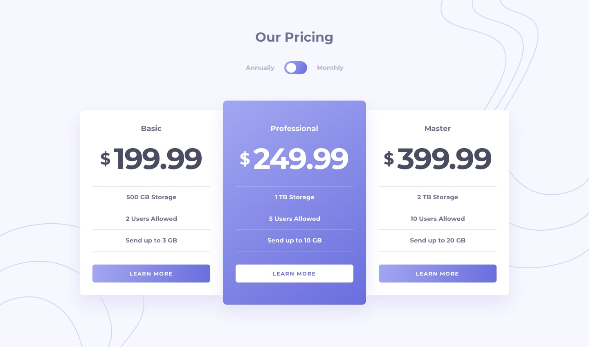

<h2 align="center"> 
	Pricing Component with Toggle
</h2>

<h1 align="center">
    
</h1>
## 💻 About

 The challenge was to build out this pricing component and get it looking as close to the design as possible
---
## ⚙️ Tasks

- [x] View the optimal layout for the component depending on their device's screen size
- [x] Control the toggle with both their mouse/trackpad and their keyboard

---

## 🎨 Layout

---

## 🦸 Author

<a href="https://github.com/zLeoo">
 
  
 <b>Leonardo dos Santos</b></a> <a href="#" >🚀</a>
  

